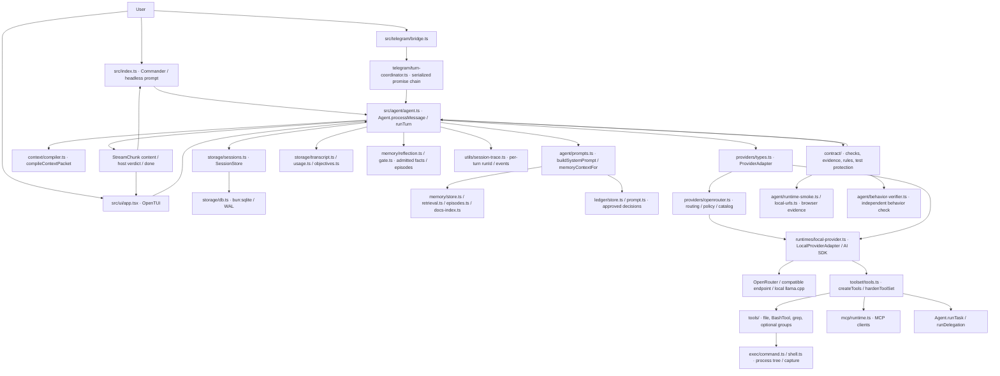
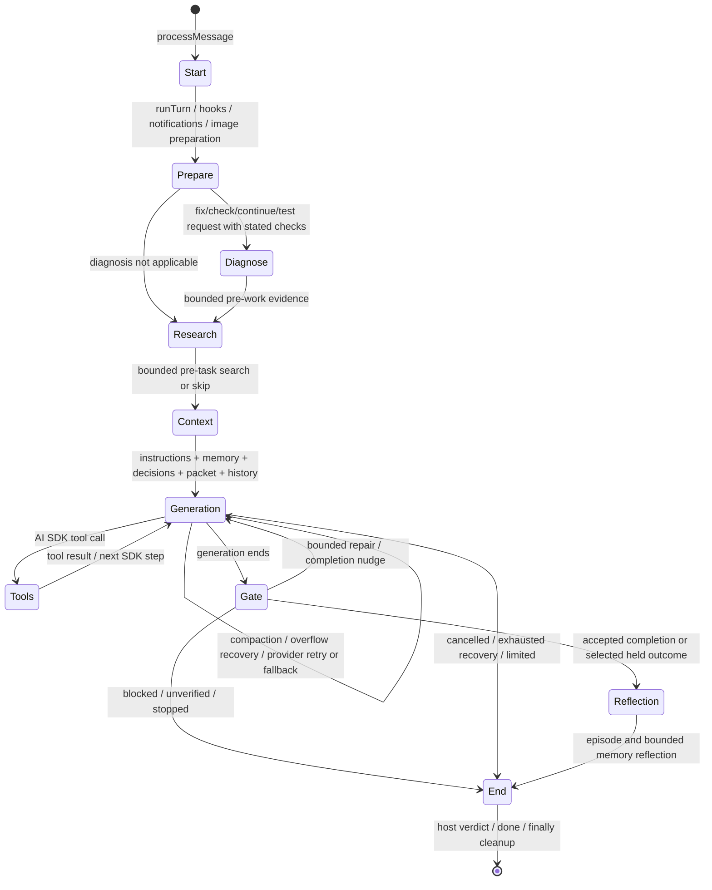

# Current ShelraCode architecture

Evidence date: 2026-10-04, inspected working tree. This is the implementation, including the repairs in this audit. Historical `ShelraCode/` is a separate reference checkout and was excluded.

## Product boundaries

The production coding path is a Bun CLI, not a browser application backed by an agent server. `src/index.ts` constructs `Agent`; headless prompts and the OpenTUI interface consume the same async generator. The optional Telegram bridge also calls that generator. SQLite and the filesystem are local. A model endpoint is the remote service; managed llama.cpp is the secondary local endpoint.

`frontend/` is a separate Next.js marketing, authentication and demo application. Its demo dashboard state is not a transport to `Agent.processMessage`. `backend/` is the local, gitignored Bun/Supabase account service; its account/device endpoints do not execute agent turns. Browser reconnect tests against those applications cannot establish the reliability of CLI streaming. Root validation does not cover either package.

The optional `--autonomous` path still uses `src/autonomy/runtime.ts` and `AutonomyKernel`, rather than the main Agent. It is a distinct implementation, explicitly retiring according to repository guidance. Claims about one runtime must not be transferred to the other.

## Actual turn lifecycle

`processMessage` creates a trace, delegates to `runTurn`, and in `finally` records otherwise unlearned work, delivers reminders, removes the live memory record and ends the trace. `runTurn` resets an instance-owned abort controller and turn state. Its `AgentKernel` records objective, scope, observations, mutations and verification; it is a lifecycle record, not a dependency planner.

These are control-flow states. There is no mandatory separate UNDERSTAND, dependency graph, host-authored decomposition or explicit hypothesis-revision engine. Planning tools publish a model-authored plan and normalize imperfect arguments. The model decides whether to use them. `AgentKernel.transition` does not enforce this diagram as a legal-transition table; parts of completion state are also held in local variables, plan state, evidence arrays, database rows and episodes.

## Every primary model request

| Layer | Actual owner | Selection and limits | Important limitation |
| --- | --- | --- | --- |
| Mode/system instructions | `agent/prompts.ts`, project instruction loader | Coding guidance, available groups, instruction files, active decisions | Repository instruction files are privileged instructions, not sandboxed untrusted data |
| Current request | `runTurn`, `buildVisionUserMessages` | User message; images now share a deadline and size bound | Very large text can be truncated to the context budget |
| Repository packet | `context/compiler.ts` | Request classification, bounded discovery and selected paths/content | No persistent complete symbol/call/dependency graph |
| Project/user memory | `memoryContextFor`, `retrieval.ts` | Standing statements plus lexical ranked bodies and pointers | Ranking is imperfect; loading uses synchronous disk work |
| Open work | `episodes.ts`, `plans/state.ts` | Latest open plans by title; continuation adopts one | Three open plans shown by default; a title is not a globally unique task identity |
| Documentation | `docs-index.ts` | README orientation and up to three related document pointers | A pointer is not the full architecture; model must read it |
| Conversation | `storage/transcript-view.ts`, Agent messages | Transcript/checkpoint plus recent history | Summary text is model generated; audit now pins current objective and existing criteria |
| Tool observations | AI SDK response messages | Bounded built-in read/shell output; stale results cleared per step | MCP/optional outputs lack a universal cap; full persisted history still grows |
| Verification/errors | Agent repair prompts and `contract/` | Parsed failures, evidence receipts, rule violations, baseline failures | Incorrect guards can inject authoritative instructions that contradict the user |
| Schemas | `createTools`, configured MCP clients | Mode/capability/group selected | Character-based context estimate does not include the complete wire schema cost |

At approximately 160,000 history characters, `providers/stale-tool-results.ts` replaces older tool output with notes, preserving the latest three assistant steps and selected durable tools. It also shortens old write/edit input whose content exists on disk. This clears model input, not the durable transcript. Compaction is bounded to a small number of passes; overflow recovery eventually uses a reduced prompt/tool set. Neither mechanism proves preservation of all historical constraints.

The audit added numeric context events after adapter preparation: system size, history before/after clearing, and message count. These are characters, not a tokenizer or complete HTTP payload measurement. Per-step usage records are actual provider token counts when supplied.

New image file-part data uses base64 strings accepted by the SDK, after bounded source preparation. Raw Buffer/Uint8Array values lost their SDK type through the transcript's JSON serialization; two local/remote regressions prove replay validity and exact byte preservation after the repair. Existing binary-object rows were not migrated, and this does not measure actual model visual understanding.

## Execution, cancellation and completion

The AI SDK runs multiple model/tool steps inside a single provider round. `stopWhen` includes a step limit, six repeating tool steps, twelve read/search/command steps without new lexical information, and host circle/blocker conditions. `agent/circles.ts` additionally recognizes repeated edit versions and a repeated check failure across changed versions. One explanation allows another strategy; repeated host stopping reaches the completion gate. These are real safeguards, but lexical novelty can be generated without engineering progress.

Provider recovery retains completed step messages and retries/fails over within routing policy. Strict benchmark models are not replaced. The free policy is restricted to free OpenRouter models and an already available local fallback. Cross-provider fallback belongs to Mixed mode. Recovery notices and host outcomes are essential: `content` may contain optimistic model prose before the final host verdict.

Checks are discovered by `contract/discover.ts`. The final gate runs or reuses sufficiently recent checks, compares prior failures, scopes timed-out suites, protects existing tests/check definitions and recognized standing rules, validates decision checks, may invoke an independent behavior checker, opens applicable web apps and checks final local URLs. This is substantially more than a prompt/tool loop. It still cannot prove acceptance merely from a generic passing test, and keyword-based test-change permissions can block legitimate API changes.

Shell execution uses ignored stdin, bounded in-memory captures, process-tree killing, a deadline and memory sampling. Background processes use logs and explicit stop tools. The audit fixed abort settlement and long stderr parsing. `killProcessTree` itself still has an unbounded Windows taskkill callback; log backpressure, synchronous file work and some installer/bridge downloads remain uncovered deadline paths.

## Persistence and concurrency boundaries

SQLite uses WAL, foreign keys and a 5-second busy timeout. Its synchronous API can block the Bun event loop while waiting. Transactions protect selected compound writes, not a whole agent turn. Partial file edits are not rolled back when a process dies. Transcript, checkpoints, usage, objectives and tool results are separate from project Markdown/JSONL memory.

An isolated external-writer experiment confirms this database path delays a 20 ms abort timer until 5,337–5,394 ms, then returns SQLITE_BUSY; integrity checks pass. It is bounded blocking rather than an inferred infinite deadlock. MCP tool failures now pass through common interpretation in host and persistence, and the MCP SDK converter receives explicit `error-text` when `isError` is true. Successful image/structured conversion remains unchanged.

File-store read/modify/write operations now use a bounded per-directory process lock, unique admission tickets and atomic temporary files. Recovery verifies the dead owner's identity before removing its lock; queued writers prevent immediate whole-batch reacquisition. The one-second bound is unchanged and now uses a monotonic clock. These repairs were required by failed full-suite runs after the first isolated lock success. They do not make topic body + index + history one transactional commit, nor recover an abandoned `.write-lock.reap` mutex. Episode rotation, document index refresh and decision files have their own concurrency/recovery questions.

TUI queues turns. Telegram's single coordinator serializes all callers on one promise chain: a pending first turn delays later callers. Calling the same `Agent` concurrently is unsafe because turn state is mutable on the instance. Separate CLI processes avoid most globals but share project files and user resources. The audit removed the module-global process-manager registry; process ownership is now instance scoped. Separate real Agent instances at 1/3/5 with isolated projects and a scripted provider settle all 27 fixture turns without foreign project markers; 17/18 unrelated turns finish before the pending stream is canceled. In the latest run the intended 400 ms abort timer fires at 414–431, 746–769 and 1,178–1,220 ms respectively. Attribution needs profiling. This is not a real-provider load, SQLite persistence or multi-tenant security test.

## Smallest justified evolution

Keep Bun, the provider interface, working tools, retrieval, evidence gate and SQLite. First establish an explicit persisted task record for objective, constraints, accepted criteria, plan status and verified observations. Give every external operation a named owner, signal and hard settlement policy. Centralize final episode/task persistence so closing branches cannot omit state. Separate immutable check definitions from code-under-test classification. Add measured progress and queue state to traces; do not invent semantic progress from elapsed time or fresh words. Extract orchestration pieces from `agent.ts` only along these proven ownership boundaries.
